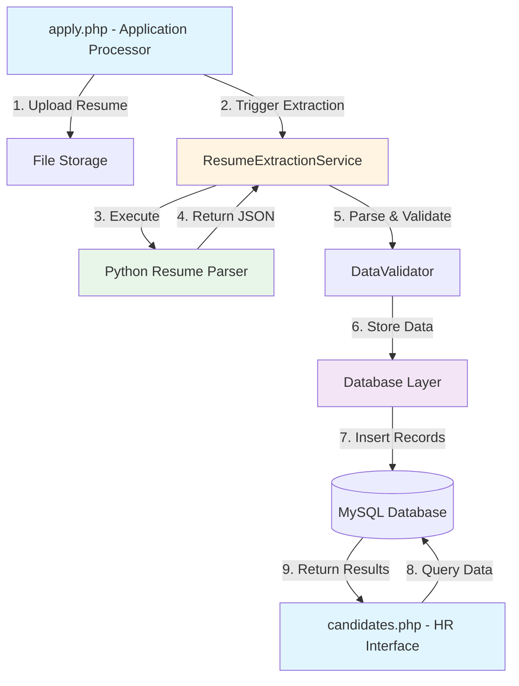
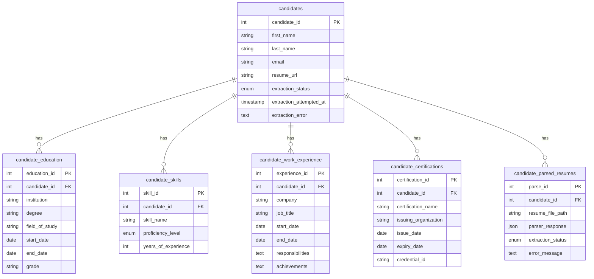

# Design Document: AI Resume Extraction and Storage

## Overview

The AI Resume Extraction and Storage system extends the existing HRMS recruitment workflow by automatically parsing uploaded resume documents and storing structured candidate information in the database. This design integrates a Python-based resume parser with the PHP application layer, creating a seamless extraction pipeline that runs during job application submission.

The system architecture follows a service-oriented approach where the PHP application acts as the orchestrator, delegating document parsing to an external Python service and managing data persistence through a normalized database schema. This separation of concerns allows the Python parser to be developed, tested, and updated independently while maintaining a stable integration interface.

Key design principles:
- **Asynchronous processing**: Resume extraction does not block application submission
- **Fault tolerance**: Extraction failures do not prevent candidates from applying
- **Data normalization**: Extracted information is stored in dedicated tables for efficient querying
- **Audit trail**: Complete extraction history is preserved for troubleshooting
- **Extensibility**: The parser interface supports future enhancements (e.g., AI provider integration)

## Architecture

### System Components



### Data Flow

1. **Application Submission**: Candidate uploads resume through apply.php
2. **File Storage**: Resume is saved to uploads/resumes/ directory
3. **Extraction Trigger**: ResumeExtractionService is invoked with file path and candidate_id
4. **Parser Execution**: Python parser processes the document and returns structured JSON
5. **Data Validation**: Extracted data is validated for completeness and consistency
6. **Database Persistence**: Validated records are inserted into normalized tables
7. **Status Update**: Candidate record is updated with extraction status
8. **HR Review**: HR staff view extracted data through candidates.php interface

### Integration Points

- **PHP to Python**: Command-line execution with JSON output capture
- **PHP to Database**: PDO prepared statements for secure data insertion
- **Database to UI**: Query layer for retrieving and displaying extracted data

## Components and Interfaces

### 1. ResumeExtractionService (PHP)

**Purpose**: Orchestrates the resume extraction workflow

**Public Methods**:
```php
class ResumeExtractionService {
    /**
     * Extract resume data and store in database
     * @param int $candidateId - The candidate's database ID
     * @param string $resumePath - Absolute path to resume file
     * @return array - ['success' => bool, 'message' => string, 'data' => array|null]
     */
    public function extractAndStore($candidateId, $resumePath): array
    
    /**
     * Execute Python parser and capture output
     * @param string $resumePath - Absolute path to resume file
     * @return array - ['success' => bool, 'output' => string, 'error' => string|null]
     */
    private function executePythonParser($resumePath): array
    
    /**
     * Parse JSON output from Python parser
     * @param string $jsonOutput - Raw JSON string from parser
     * @return array - ['success' => bool, 'data' => array|null, 'error' => string|null]
     */
    private function parseParserOutput($jsonOutput): array
    
    /**
     * Update candidate extraction status
     * @param int $candidateId
     * @param string $status - 'processing', 'completed', 'failed'
     * @param string|null $errorMessage
     */
    private function updateExtractionStatus($candidateId, $status, $errorMessage = null): void
}
```

**Configuration Constants**:
```php
define('PYTHON_EXECUTABLE', '/usr/bin/python3');
define('RESUME_PARSER_SCRIPT', __DIR__ . '/parsers/resume_parser.py');
define('PARSER_TIMEOUT', 30); // seconds
```

### 2. DataValidator (PHP)

**Purpose**: Validates extracted data before database insertion

**Public Methods**:
```php
class DataValidator {
    /**
     * Validate education record
     * @param array $education - Education data from parser
     * @return array - ['valid' => bool, 'errors' => array]
     */
    public function validateEducation($education): array
    
    /**
     * Validate work experience record
     * @param array $experience - Experience data from parser
     * @return array - ['valid' => bool, 'errors' => array]
     */
    public function validateWorkExperience($experience): array
    
    /**
     * Validate skill record
     * @param array $skill - Skill data from parser
     * @return array - ['valid' => bool, 'errors' => array]
     */
    public function validateSkill($skill): array
    
    /**
     * Validate certification record
     * @param array $certification - Certification data from parser
     * @return array - ['valid' => bool, 'errors' => array]
     */
    public function validateCertification($certification): array
    
    /**
     * Sanitize string for database storage
     * @param string $value
     * @return string
     */
    public function sanitize($value): string
}
```

**Validation Rules**:
- Education: degree and institution are required
- Work Experience: job_title and company are required
- Skills: skill_name is required
- Certifications: certification_name and issuing_organization are required
- All text fields are trimmed and sanitized

### 3. CandidateDataRepository (PHP)

**Purpose**: Handles database operations for candidate extracted data

**Public Methods**:
```php
class CandidateDataRepository {
    /**
     * Store education records for a candidate
     * @param int $candidateId
     * @param array $educationRecords
     * @return bool
     */
    public function storeEducation($candidateId, $educationRecords): bool
    
    /**
     * Store skill records for a candidate
     * @param int $candidateId
     * @param array $skillRecords
     * @return bool
     */
    public function storeSkills($candidateId, $skillRecords): bool
    
    /**
     * Store work experience records for a candidate
     * @param int $candidateId
     * @param array $experienceRecords
     * @return bool
     */
    public function storeWorkExperience($candidateId, $experienceRecords): bool
    
    /**
     * Store certification records for a candidate
     * @param int $candidateId
     * @param array $certificationRecords
     * @return bool
     */
    public function storeCertifications($candidateId, $certificationRecords): bool
    
    /**
     * Delete existing extracted data for a candidate (for re-extraction)
     * @param int $candidateId
     * @return bool
     */
    public function deleteExistingData($candidateId): bool
    
    /**
     * Store complete parser response for audit
     * @param int $candidateId
     * @param string $jsonResponse
     * @return bool
     */
    public function storeParserResponse($candidateId, $jsonResponse): bool
    
    /**
     * Retrieve all extracted data for a candidate
     * @param int $candidateId
     * @return array - ['education' => array, 'skills' => array, 'experience' => array, 'certifications' => array]
     */
    public function getCandidateData($candidateId): array
}
```

### 4. Python Resume Parser

**Purpose**: Extract structured data from resume documents

**Command-Line Interface**:
```bash
python3 resume_parser.py <resume_file_path>
```

**Output Format** (JSON to stdout):
```json
{
  "success": true,
  "data": {
    "contact_info": {
      "name": "John Doe",
      "email": "john@example.com",
      "phone": "+1234567890"
    },
    "education": [
      {
        "institution": "University of Example",
        "degree": "Bachelor of Science",
        "field_of_study": "Computer Science",
        "start_date": "2015-09-01",
        "end_date": "2019-06-01",
        "grade": "3.8 GPA"
      }
    ],
    "work_experience": [
      {
        "company": "Tech Corp",
        "job_title": "Software Engineer",
        "start_date": "2019-07-01",
        "end_date": "2023-12-31",
        "responsibilities": "Developed web applications",
        "achievements": "Led team of 5 developers"
      }
    ],
    "skills": [
      {
        "skill_name": "Python",
        "proficiency_level": "Expert",
        "years_of_experience": 5
      }
    ],
    "certifications": [
      {
        "certification_name": "AWS Certified Developer",
        "issuing_organization": "Amazon Web Services",
        "issue_date": "2022-03-15",
        "expiry_date": "2025-03-15",
        "credential_id": "ABC123"
      }
    ]
  },
  "metadata": {
    "parser_version": "1.0.0",
    "extraction_date": "2024-01-15T10:30:00Z",
    "file_type": "pdf"
  }
}
```

**Error Output**:
```json
{
  "success": false,
  "error": "Failed to parse document: Unsupported file format",
  "metadata": {
    "parser_version": "1.0.0",
    "extraction_date": "2024-01-15T10:30:00Z"
  }
}
```

### 5. HR Review Interface (candidates.php)

**Purpose**: Display extracted candidate data to HR staff

**New UI Components**:
- Education History Section: Displays degrees in chronological order
- Skills Matrix: Groups skills by proficiency level
- Work Experience Timeline: Shows career progression
- Certifications Panel: Lists active and expired certifications
- Extraction Status Badge: Indicates parsing status (completed/failed/pending)

## Data Models

### Database Schema

#### 1. candidate_education

```sql
CREATE TABLE candidate_education (
    education_id INT AUTO_INCREMENT PRIMARY KEY,
    candidate_id INT NOT NULL,
    institution VARCHAR(255) NOT NULL,
    degree VARCHAR(100) NOT NULL,
    field_of_study VARCHAR(100),
    start_date DATE,
    end_date DATE,
    grade VARCHAR(50),
    created_at TIMESTAMP DEFAULT CURRENT_TIMESTAMP,
    updated_at TIMESTAMP DEFAULT CURRENT_TIMESTAMP ON UPDATE CURRENT_TIMESTAMP,
    FOREIGN KEY (candidate_id) REFERENCES candidates(candidate_id) ON DELETE CASCADE,
    INDEX idx_candidate_education (candidate_id)
);
```

#### 2. candidate_skills

```sql
CREATE TABLE candidate_skills (
    skill_id INT AUTO_INCREMENT PRIMARY KEY,
    candidate_id INT NOT NULL,
    skill_name VARCHAR(100) NOT NULL,
    proficiency_level ENUM('Beginner', 'Intermediate', 'Advanced', 'Expert') DEFAULT 'Intermediate',
    years_of_experience INT,
    created_at TIMESTAMP DEFAULT CURRENT_TIMESTAMP,
    updated_at TIMESTAMP DEFAULT CURRENT_TIMESTAMP ON UPDATE CURRENT_TIMESTAMP,
    FOREIGN KEY (candidate_id) REFERENCES candidates(candidate_id) ON DELETE CASCADE,
    INDEX idx_candidate_skills (candidate_id),
    INDEX idx_skill_name (skill_name)
);
```

#### 3. candidate_work_experience

```sql
CREATE TABLE candidate_work_experience (
    experience_id INT AUTO_INCREMENT PRIMARY KEY,
    candidate_id INT NOT NULL,
    company VARCHAR(255) NOT NULL,
    job_title VARCHAR(100) NOT NULL,
    start_date DATE,
    end_date DATE,
    responsibilities TEXT,
    achievements TEXT,
    created_at TIMESTAMP DEFAULT CURRENT_TIMESTAMP,
    updated_at TIMESTAMP DEFAULT CURRENT_TIMESTAMP ON UPDATE CURRENT_TIMESTAMP,
    FOREIGN KEY (candidate_id) REFERENCES candidates(candidate_id) ON DELETE CASCADE,
    INDEX idx_candidate_experience (candidate_id)
);
```

#### 4. candidate_certifications

```sql
CREATE TABLE candidate_certifications (
    certification_id INT AUTO_INCREMENT PRIMARY KEY,
    candidate_id INT NOT NULL,
    certification_name VARCHAR(255) NOT NULL,
    issuing_organization VARCHAR(255) NOT NULL,
    issue_date DATE,
    expiry_date DATE,
    credential_id VARCHAR(100),
    created_at TIMESTAMP DEFAULT CURRENT_TIMESTAMP,
    updated_at TIMESTAMP DEFAULT CURRENT_TIMESTAMP ON UPDATE CURRENT_TIMESTAMP,
    FOREIGN KEY (candidate_id) REFERENCES candidates(candidate_id) ON DELETE CASCADE,
    INDEX idx_candidate_certifications (candidate_id)
);
```

#### 5. candidate_parsed_resumes (Audit Table)

```sql
CREATE TABLE candidate_parsed_resumes (
    parse_id INT AUTO_INCREMENT PRIMARY KEY,
    candidate_id INT NOT NULL,
    resume_file_path VARCHAR(255) NOT NULL,
    parser_response JSON NOT NULL,
    extraction_status ENUM('completed', 'failed') NOT NULL,
    error_message TEXT,
    parsed_at TIMESTAMP DEFAULT CURRENT_TIMESTAMP,
    FOREIGN KEY (candidate_id) REFERENCES candidates(candidate_id) ON DELETE CASCADE,
    INDEX idx_candidate_parsed (candidate_id)
);
```

#### 6. Modifications to candidates table

```sql
ALTER TABLE candidates 
ADD COLUMN extraction_status ENUM('pending', 'processing', 'completed', 'failed') DEFAULT 'pending',
ADD COLUMN extraction_attempted_at TIMESTAMP NULL,
ADD COLUMN extraction_error TEXT NULL;
```

### Data Relationships




## Correctness Properties

A property is a characteristic or behavior that should hold true across all valid executions of a system—essentially, a formal statement about what the system should do. Properties serve as the bridge between human-readable specifications and machine-verifiable correctness guarantees.

### Property Reflection

After analyzing all acceptance criteria, I identified several opportunities to consolidate redundant properties:

**Consolidation 1**: Requirements 4.1-4.4 (inserting education, skills, experience, certifications) can be combined into a single comprehensive property about data insertion after successful extraction.

**Consolidation 2**: Requirements 7.1-7.3 (logging parser failures, JSON failures, database failures) can be combined into a single property about error logging with required context.

**Consolidation 3**: Requirements 8.1-8.3 (validating required fields for education, experience, skills) can be combined into a single property about required field validation.

**Consolidation 4**: Requirements 10.3-10.5 (status transitions for processing, completed, failed) can be combined into a single property about status tracking throughout the extraction lifecycle.

**Consolidation 5**: Schema validation requirements (1.1-1.6, 10.1-10.2) are all examples of checking database structure, so they can be grouped as unit test examples rather than separate properties.

### Core Properties

**Property 1: Parser Execution with File Path**
*For any* valid resume file path provided to the ResumeExtractionService, the service should execute the Python parser with that file path as a command-line argument and capture the output from stdout.
**Validates: Requirements 2.1, 2.2, 2.3**

**Property 2: Parser Execution Error Handling**
*For any* Python parser execution that fails or times out, the PHP_Integration_Service should log the error with candidate_id and file path, return a failure status, and terminate any running process.
**Validates: Requirements 2.4, 2.6**

**Property 3: JSON Parsing and Validation**
*For any* JSON output received from the Python parser, the PHP_Integration_Service should parse it into a PHP array, validate that required fields (success, data, metadata) exist, and handle missing or malformed JSON gracefully without throwing errors.
**Validates: Requirements 3.1, 3.2, 3.3, 3.5**

**Property 4: Data Extraction from JSON**
*For any* valid parsed JSON data object, the PHP_Integration_Service should extract contact_info, work_experience, education, skills, and certifications fields.
**Validates: Requirements 3.4**

**Property 5: Successful Data Insertion**
*For any* successful extraction with valid data, the PHP_Integration_Service should insert all extracted records (education, skills, work experience, certifications) into their respective database tables and store the complete JSON response in the audit table.
**Validates: Requirements 4.1, 4.2, 4.3, 4.4, 4.8**

**Property 6: Data Replacement on Re-extraction**
*For any* candidate with existing extracted data, when a new resume is processed, the PHP_Integration_Service should delete all existing records before inserting new ones, ensuring no duplicate or stale data remains.
**Validates: Requirements 4.5**

**Property 7: Transaction Atomicity**
*For any* data insertion operation, either all records should be successfully inserted or none should be inserted (transaction rollback), and any failure should be logged with candidate_id and SQL error details.
**Validates: Requirements 4.6, 4.7**

**Property 8: Application Submission Integration**
*For any* job application submission with a resume upload, the Application_Processor should trigger resume extraction with the file path and candidate_id, and complete the application submission regardless of extraction success or failure.
**Validates: Requirements 5.1, 5.2, 5.3, 5.5**

**Property 9: Education Display Ordering**
*For any* candidate with extracted education records, the HR_Review_Interface should display them in chronological order (earliest to latest based on start_date).
**Validates: Requirements 6.1**

**Property 10: Skills Grouping by Proficiency**
*For any* candidate with extracted skills, the HR_Review_Interface should display them grouped by proficiency level (Beginner, Intermediate, Advanced, Expert).
**Validates: Requirements 6.2**

**Property 11: Work Experience Display Ordering**
*For any* candidate with extracted work experience records, the HR_Review_Interface should display them in reverse chronological order (most recent first based on end_date).
**Validates: Requirements 6.3**

**Property 12: Certification Expiry Status**
*For any* candidate with extracted certifications, the HR_Review_Interface should display each certification with an expiry status indicator (active if expiry_date is in the future, expired if in the past, or no expiry if expiry_date is null).
**Validates: Requirements 6.4**

**Property 13: Resume Download Link**
*For any* candidate with a resume_url, the HR_Review_Interface should provide a clickable download link to the original resume file.
**Validates: Requirements 6.6**

**Property 14: Comprehensive Error Logging**
*For any* extraction error (parser failure, JSON parsing failure, or database failure), the System should log the error to logs/resume_extraction.log with timestamp, severity level, candidate_id, and error-specific context (file path for parser errors, raw output for JSON errors, SQL details for database errors).
**Validates: Requirements 7.1, 7.2, 7.3, 7.4, 7.5**

**Property 15: Extraction Status Tracking**
*For any* extraction attempt, the System should update the extraction_status field to 'failed' with error details if extraction fails, and update extraction_attempted_at timestamp.
**Validates: Requirements 7.6**

**Property 16: Required Field Validation**
*For any* extracted record (education, work experience, or skill), the PHP_Integration_Service should validate that required fields are not empty (degree and institution for education, job_title and company for work experience, skill_name for skills), and skip invalid records while logging the validation failure.
**Validates: Requirements 8.1, 8.2, 8.3, 8.6, 8.7**

**Property 17: Text Field Sanitization**
*For any* text field in extracted data, the PHP_Integration_Service should trim whitespace and use prepared statements to prevent SQL injection.
**Validates: Requirements 8.4, 8.5**

**Property 18: Configuration Validation**
*For any* extraction attempt, the System should validate that the Python executable and parser script exist before execution, and return a configuration failure status with logged error if either is missing.
**Validates: Requirements 9.3, 9.4, 9.5**

**Property 19: Extraction Status Lifecycle**
*For any* extraction process, the System should set extraction_status to 'processing' when extraction starts, 'completed' when extraction succeeds, and 'failed' when extraction fails.
**Validates: Requirements 10.3, 10.4, 10.5**

## Error Handling

### Error Categories

1. **Configuration Errors**
   - Missing Python executable
   - Missing parser script
   - Invalid file paths
   - **Handling**: Log error, return configuration failure, do not attempt execution

2. **Parser Execution Errors**
   - Parser crashes or returns non-zero exit code
   - Parser timeout (>30 seconds)
   - Unsupported file format
   - **Handling**: Log error with file path, update extraction_status to 'failed', continue application submission

3. **JSON Parsing Errors**
   - Malformed JSON output
   - Missing required fields
   - Invalid data types
   - **Handling**: Log error with raw output, update extraction_status to 'failed', continue application submission

4. **Validation Errors**
   - Missing required fields in extracted data
   - Invalid date formats
   - Empty or whitespace-only values
   - **Handling**: Skip invalid records, log validation failures, insert valid records

5. **Database Errors**
   - Connection failures
   - Constraint violations
   - Transaction rollback
   - **Handling**: Roll back transaction, log SQL error, update extraction_status to 'failed'

### Error Recovery Strategies

- **Graceful Degradation**: Application submission succeeds even if extraction fails
- **Partial Success**: Valid records are inserted even if some records fail validation
- **Retry Mechanism**: HR staff can manually trigger re-extraction from candidates.php
- **Audit Trail**: All extraction attempts and failures are logged for troubleshooting

### Logging Strategy

All errors are logged to `logs/resume_extraction.log` with the following format:
```
[2024-01-15 10:30:45] [ERROR] [CandidateID: 123] Parser execution failed: File not found - /path/to/resume.pdf
[2024-01-15 10:31:12] [WARNING] [CandidateID: 124] Validation failed for education record: Missing required field 'degree'
[2024-01-15 10:32:03] [INFO] [CandidateID: 125] Extraction completed successfully: 3 education, 8 skills, 2 experience, 1 certification
```

## Testing Strategy

### Dual Testing Approach

This feature requires both unit tests and property-based tests to ensure comprehensive coverage:

- **Unit tests**: Verify specific examples, edge cases, and error conditions
- **Property tests**: Verify universal properties across all inputs

Together, these approaches provide comprehensive coverage where unit tests catch concrete bugs and property tests verify general correctness.

### Property-Based Testing

We will use **PHPUnit with Eris** (a property-based testing library for PHP) to implement property tests. Each property test will:
- Run a minimum of 100 iterations with randomized inputs
- Reference its corresponding design property in a comment tag
- Tag format: `// Feature: ai-resume-extractor-storage, Property N: [property text]`

**Example Property Test Structure**:
```php
/**
 * @test
 * Feature: ai-resume-extractor-storage, Property 3: JSON Parsing and Validation
 */
public function test_json_parsing_handles_all_valid_and_invalid_inputs() {
    $this->forAll(
        Generator\oneOf(
            Generator\json(),  // Valid JSON
            Generator\string() // Invalid JSON
        )
    )->then(function ($jsonInput) {
        $service = new ResumeExtractionService();
        $result = $service->parseParserOutput($jsonInput);
        
        // Should never throw exception
        $this->assertIsArray($result);
        $this->assertArrayHasKey('success', $result);
        
        // If parsing fails, should have error message
        if (!$result['success']) {
            $this->assertArrayHasKey('error', $result);
        }
    });
}
```

### Unit Testing Focus Areas

Unit tests should focus on:

1. **Database Schema Validation**
   - Verify all tables exist with correct structure
   - Verify foreign key constraints
   - Verify indexes are created

2. **Specific Error Scenarios**
   - Parser returns specific error codes
   - Database constraint violations
   - File permission errors

3. **Edge Cases**
   - Empty education/skills/experience arrays
   - Null or missing optional fields
   - Very long text fields
   - Special characters in text

4. **Integration Points**
   - apply.php triggers extraction correctly
   - candidates.php displays data correctly
   - Status updates are reflected in UI

### Test Coverage Goals

- **Code Coverage**: Minimum 80% line coverage
- **Property Tests**: All 19 properties implemented
- **Unit Tests**: Minimum 50 unit tests covering edge cases and examples
- **Integration Tests**: End-to-end tests for application submission and HR review flows

### Testing Configuration

```php
// phpunit.xml
<phpunit>
    <testsuites>
        <testsuite name="ResumeExtraction">
            <directory>tests/ResumeExtraction</directory>
        </testsuite>
    </testsuites>
    <php>
        <env name="ERIS_ITERATIONS" value="100"/>
    </php>
</phpunit>
```

### Mock Data Generation

For property tests, we need generators for:
- Valid resume file paths
- Valid and invalid JSON structures
- Candidate IDs
- Education records with various field combinations
- Skills with different proficiency levels
- Work experience with date ranges
- Certifications with expiry dates

### Test Database

All tests should use a separate test database to avoid affecting production data:
- Database: `hr_system_test`
- Automatic rollback after each test
- Seeded with minimal test data
